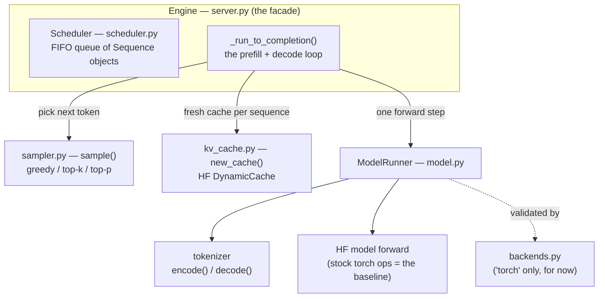
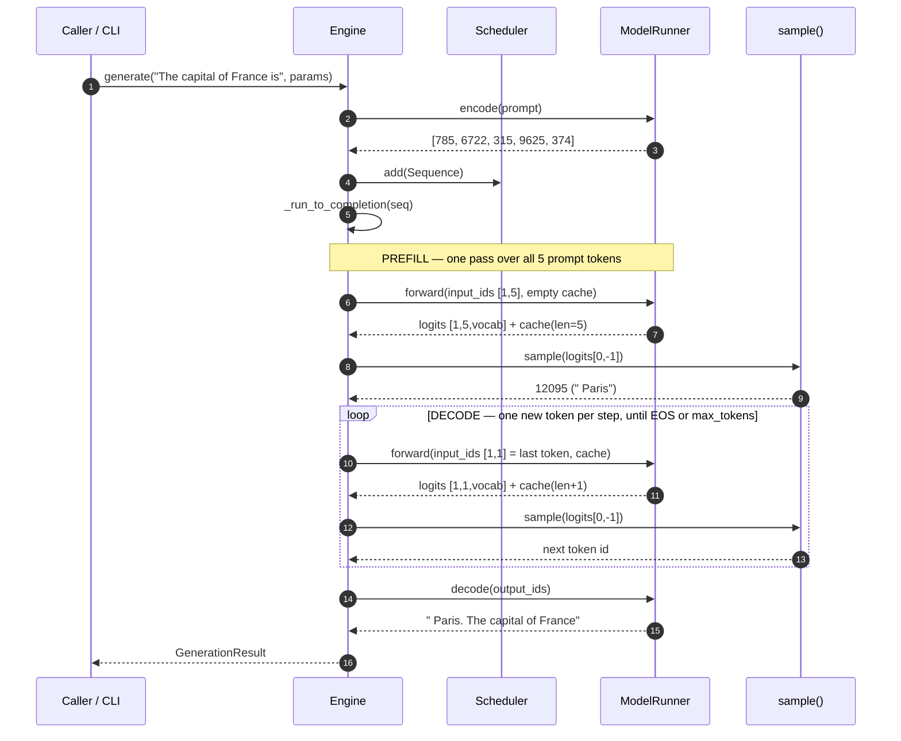
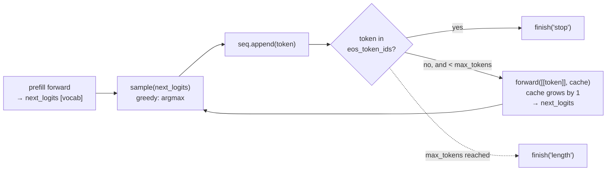

# mini-serve

A **minimal LLM serving engine used as a lab bench** — not a product. See
`../serving_engine_project.md` for the full rationale. The engine is never the
deliverable; it's the harness that hosts a series of bounded, publishable
experiments (kernels, scheduling, quantization, …), each producing one number
and one lesson.

**This repo currently contains experiment 0 only:** serve one model, greedy
decode, correct vs HuggingFace. Everything else is a documented seam, not code.

## Layout

```
mini-serve/
  engine/                # the harness (experiment 0)
    model.py             #   ModelRunner: loads one HF model, one forward step (torch-op baseline)
    kv_cache.py          #   KV cache factory (HF DynamicCache) — paged-KV seam (exp 2)
    sampler.py           #   greedy + temperature/top-k/top-p
    scheduler.py         #   Sequence lifecycle + FIFO admission — batching seam (exp 1)
    backends.py          #   op-swap registry — kernel seam (exp 4)
    server.py            #   Engine facade (prefill+decode loop) + CLI
  eval/check_vs_hf.py    # correctness gate: engine greedy == HF, token-for-token
  bench/bench_e2e.py     # end-to-end TTFT + decode tokens/sec (the anchor number)
  autotune/              # exp F2 — placeholder, do not build before exp 4
  results/               # committed receipts (JSON + raw ncu/nsys)
```

`kernels/` from the doc's layout is **not duplicated here** — it's the sibling
`../gpu-kernels/` repo (with the `gpubench` harness). It gets wired in at
`engine/backends.py` swap points during experiment 4; until then the engine runs
stock HF ops.

## How it works (end to end)

Text generation is just this loop: **turn text into token ids → run the model to
get scores for the next token → pick one → feed it back → repeat.** The engine's
whole job is to run that loop correctly and to leave clean seams where later
experiments make it faster. Below we trace one real call through the code.

### The pieces and who owns what

`Engine` (in `server.py`) is the facade. It owns a `ModelRunner` (the model +
tokenizer) and a `Scheduler` (the request queue). The decode loop lives in
`Engine._run_to_completion` and leans on two tiny helpers — `sample()` and
`new_cache()`.



### One `generate()` call, start to finish

Using our example prompt `"The capital of France is"`. The tokenizer turns it
into **5 token ids** `[785, 6722, 315, 9625, 374]`, the model generates one token
at a time, and the tokenizer turns the result back into text
(`" Paris. The capital of France"`).



### The two phases: prefill vs decode

There are two distinct phases, and they behave very differently — which is why
the benchmark reports them separately (TTFT vs decode tokens/sec).

- **Prefill** runs the model over the **whole prompt at once** (`input_ids` shape
  `[1, 5]`). This is one big batched matmul, compute-bound, and it produces the
  logits for the *first* generated token. Its latency is **TTFT** (time to first
  token).
- **Decode** then runs the model **one token at a time** (`input_ids` shape
  `[1, 1]`). Each step attends to the growing KV cache but only does a sliver of
  new compute.

The exact trace for our example (real ids from the run):

| step | phase  | `forward` input | cache len (before→after) | argmax id | piece        |
|-----:|--------|-----------------|--------------------------|-----------|--------------|
| 0    | prefill| `[785,6722,315,9625,374]` `[1,5]` | 0 → 5 | `12095` | `" Paris"`   |
| 1    | decode | `[12095]` `[1,1]`               | 5 → 6 | `13`    | `"."`        |
| 2    | decode | `[13]` `[1,1]`                  | 6 → 7 | `576`   | `" The"`     |
| 3    | decode | `[576]` `[1,1]`                 | 7 → 8 | `6722`  | `" capital"` |
| 4    | decode | `[6722]` `[1,1]`                | 8 → 9 | `315`   | `" of"`      |
| 5    | decode | `[315]` `[1,1]`                 | 9 →10 | `9625`  | `" France"`  |

The **KV cache** is what makes decode cheap: instead of re-reading all prior
tokens each step, the model keeps each layer's past keys/values and only computes
attention for the single new token. `new_cache()` hands each sequence a fresh
`DynamicCache`; the loop threads it through every `forward` call and it grows by
one row per step.

### The decode loop itself

This is the heart of `_run_to_completion`. Prefill produces the first
`next_logits`; the loop then samples, checks for a stop token, and only calls
`forward` again if it needs another token:



**Why decode is slow in this baseline (and why that's expected):** each step does
tiny GPU work but pays fixed overheads — a Python loop iteration, a kernel launch
per layer, and a device→host sync when `argmax` becomes a Python `int`. On
Qwen3-0.6B our `bench_e2e.py` measures ~**34 tokens/s (~29 ms/token)**: the GPU is
mostly idle, waiting on the CPU. That is the honest anchor number later
experiments move.

### Where the experiments plug in

The loop above never changes — each experiment swaps exactly one seam:

| Seam (file)            | Baseline today                | The experiment that replaces it            |
|------------------------|-------------------------------|--------------------------------------------|
| `scheduler.py`         | FIFO, one sequence at a time  | **exp 1** continuous batching: batch the `forward` across many sequences, hiding per-step overhead |
| `kv_cache.py`          | one `DynamicCache` per seq    | **exp 2** paged KV: fixed-size blocks from a shared pool |
| `backends.py`          | `'torch'` (stock HF ops)      | **exp 4** route attention/rmsnorm to the `gpu-kernels` CUDA/Triton kernels |
| the decode loop (CPU)  | Python                        | **exp 5** move the hot control-plane loop to Rust |

## Setup

The engine runs in a project-local venv (`--system-site-packages` off
`/opt/pytorch`, adds `transformers` without touching that shared env):

```bash
/opt/pytorch/bin/python3 -m venv --system-site-packages .venv
.venv/bin/pip install transformers accelerate
source env.sh
```

## Run

```bash
source env.sh

# Generate (defaults to Qwen/Qwen3-8B; use a small model to iterate fast):
python -m engine --model Qwen/Qwen3-0.6B --prompt "The capital of France is" --max-tokens 32

# Multiple prompts — repeat --prompt (baseline runs them sequentially, no batching yet):
python -m engine --model Qwen/Qwen3-0.6B \
  --prompt "The capital of France is" --prompt "def fibonacci(n):" --max-tokens 24

# Correctness gate (must pass before trusting any perf number):
python eval/check_vs_hf.py --model Qwen/Qwen3-0.6B

# End-to-end throughput:
python bench/bench_e2e.py --model Qwen/Qwen3-0.6B --prompt-len 512 --max-tokens 128
```

## Design rules (from the project doc)

1. **Baseline uses torch/HF ops**, so it stands up without kernel work. Each
   kernel experiment replaces *one* op and measures the delta.
2. **Correctness first**, checked against HF `generate()` every change.
3. **One model, one hardware target.** Default target is `Qwen/Qwen3-8B`;
   `Qwen/Qwen3-0.6B` (same family) is the fast smoke-test model.
4. Experiments live *around* this baseline and each ships independently. The
   seams (scheduler / kv_cache / backends) exist so an experiment changes one
   file, not the whole engine.

### Torch version note

The venv's torch (currently 2.14.0+cu130, pulled by `accelerate` — it grabs the
latest on each install) is newer than `gpu-kernels`' /opt/pytorch torch
(2.9.1+cu130). Harmless now (HF ops only); pin the deps if you want
reproducibility, and reconcile before wiring in the JIT kernels at experiment 4.
