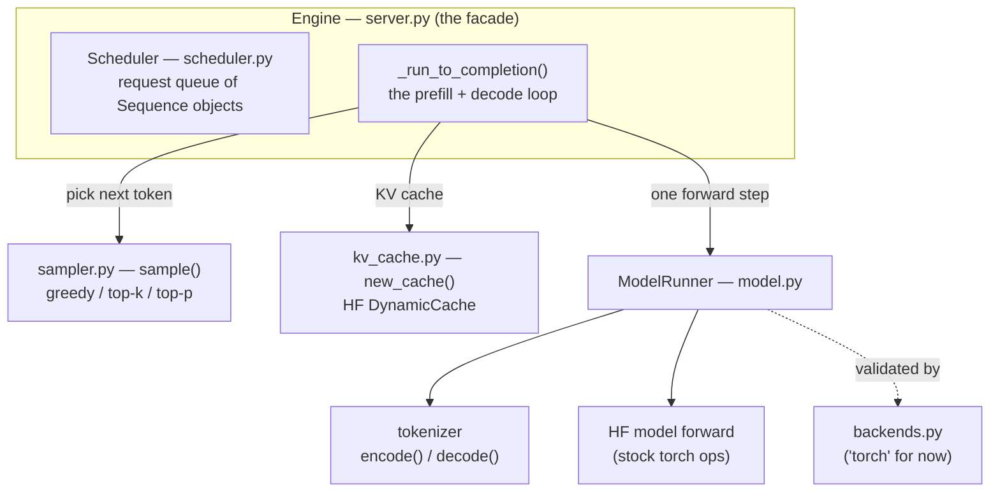
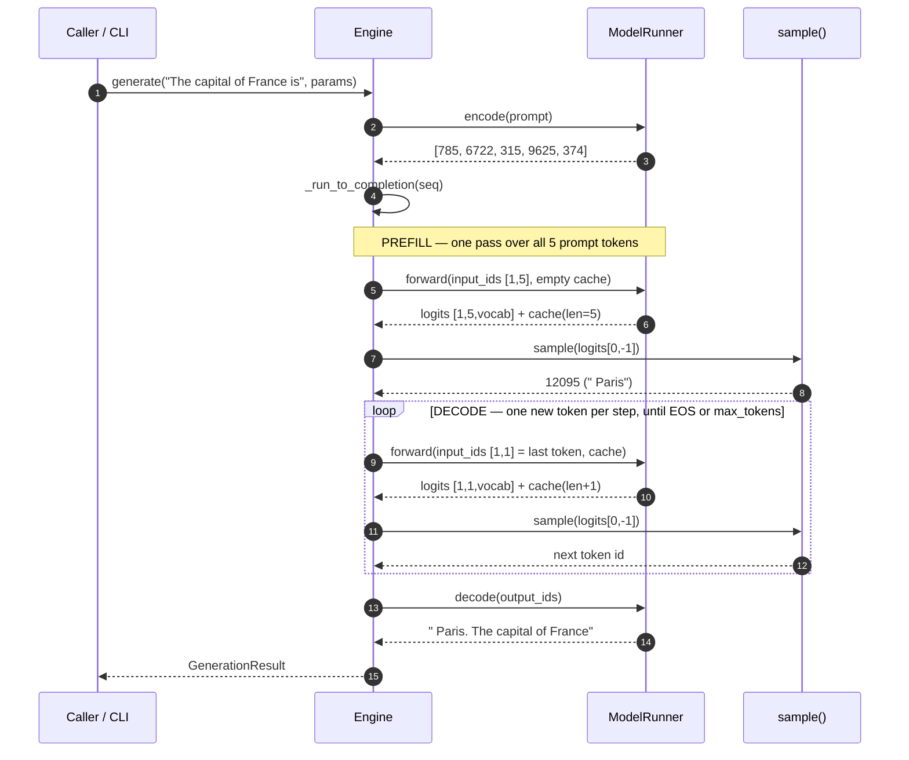
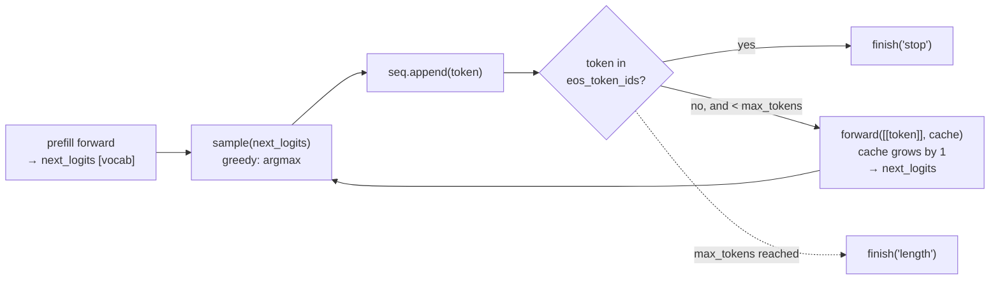
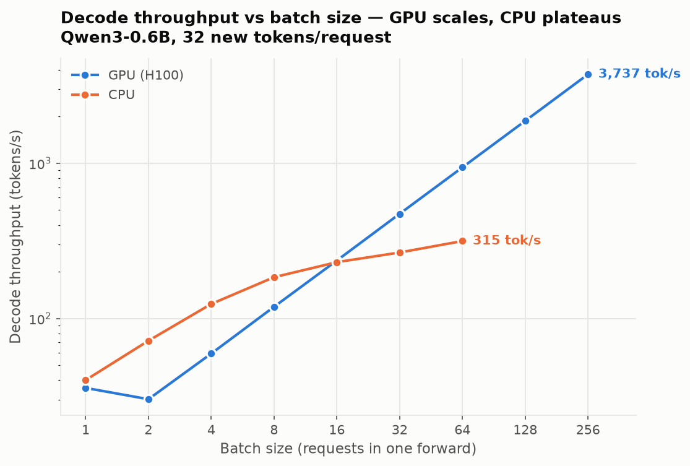

# nanoserve

A minimal LLM inference engine, built from first principles. It loads a single
Hugging Face model and runs its **own** generation loop — tokenize, prefill, then
decode one token at a time with a KV cache — instead of calling
`model.generate()`. The point is to understand and optimize the serving path end
to end: build the simplest correct version, measure it, find the bottleneck, fix
it, and keep every number honest against a reference.

Everything is checked token-for-token against Hugging Face `generate()`, and
every change is measured with the included benchmark + profiling tools.

## What it does today

- Single-request **and batched** generation (one padded forward for N prompts).
- Greedy + temperature / top-k / top-p sampling.
- KV-cache decode loop (HF `DynamicCache`).
- Runs on CPU or CUDA.
- Benchmark + `nsys` profiling harness, with committed result receipts.

## Quickstart

```bash
# one-time: project-local venv that inherits torch/triton from /opt/pytorch
/opt/pytorch/bin/python3 -m venv --system-site-packages .venv
.venv/bin/pip install transformers accelerate matplotlib
source env.sh

# generate (use a small model to iterate fast)
python -m engine --model Qwen/Qwen3-0.6B --prompt "The capital of France is" --max-tokens 32
# multiple prompts: repeat --prompt
python -m engine --model Qwen/Qwen3-0.6B \
  --prompt "The capital of France is" --prompt "def fibonacci(n):" --max-tokens 24

# benchmark + check a run against HF, writing a receipt to results/
python bench/bench.py --label run --model Qwen/Qwen3-0.6B --out results/run.json --check-hf

# batch-size sweep (throughput vs batch) + plot
python bench/sweep.py --device cuda --out results/sweep_cuda.csv
python bench/plot_sweep.py --csv results/sweep_cuda.csv --out results/sweep.png
```

## Layout

```
nanoserve/
  engine/
    model.py        # ModelRunner: loads one HF model, one forward step (stock torch ops)
    kv_cache.py     # KV cache factory (HF DynamicCache)
    sampler.py      # greedy + temperature / top-k / top-p
    scheduler.py    # Sequence lifecycle + request queue
    backends.py     # op-backend selection (where custom kernels would attach)
    server.py       # Engine (prefill + decode loop) + CLI
  bench/
    bench.py        # throughput + output-id receipts; correctness vs HF
    sweep.py        # throughput vs batch size, per device
    plot_sweep.py   # the throughput-vs-batch plot
    profile_step.py # nsys driver for one decode region
  results/          # committed receipts: CSV/JSON numbers + the sweep plot
```

## How it works (end to end)

Text generation is just this loop: **turn text into token ids → run the model to
get scores for the next token → pick one → feed it back → repeat.** The engine's
whole job is to run that loop correctly and to leave clean seams where
optimizations plug in. Below we trace one real request through the code.

### The pieces and who owns what

`Engine` (in `server.py`) is the facade. It owns a `ModelRunner` (the model +
tokenizer) and a `Scheduler` (the request queue). The decode loop lives in
`Engine._run_to_completion` and leans on two tiny helpers — `sample()` and
`new_cache()`.



### One request, start to finish

Using the prompt `"The capital of France is"`. The tokenizer turns it into **5
token ids** `[785, 6722, 315, 9625, 374]`, the model generates one token at a
time, and the tokenizer turns the result back into text
(`" Paris. The capital of France"`).



### The two phases: prefill vs decode

Two distinct phases that behave very differently — which is why the benchmark
reports them separately (TTFT vs decode tokens/sec).

- **Prefill** runs the model over the **whole prompt at once** (`input_ids` shape
  `[1, 5]`). One big batched matmul, compute-bound; it produces the logits for the
  *first* generated token. Its latency is **TTFT** (time to first token).
- **Decode** then runs the model **one token at a time** (`input_ids` shape
  `[1, 1]`). Each step attends to the growing KV cache but does only a sliver of
  new compute.

The exact trace for the example (real ids from a run):

| step | phase  | `forward` input | cache len (before→after) | argmax id | piece        |
|-----:|--------|-----------------|--------------------------|-----------|--------------|
| 0    | prefill| `[785,6722,315,9625,374]` `[1,5]` | 0 → 5 | `12095` | `" Paris"`   |
| 1    | decode | `[12095]` `[1,1]`               | 5 → 6 | `13`    | `"."`        |
| 2    | decode | `[13]` `[1,1]`                  | 6 → 7 | `576`   | `" The"`     |
| 3    | decode | `[576]` `[1,1]`                 | 7 → 8 | `6722`  | `" capital"` |
| 4    | decode | `[6722]` `[1,1]`                | 8 → 9 | `315`   | `" of"`      |
| 5    | decode | `[315]` `[1,1]`                 | 9 →10 | `9625`  | `" France"`  |

The **KV cache** is what makes decode cheap: instead of re-reading all prior
tokens each step, the model keeps each layer's past keys/values and only computes
attention for the single new token. `new_cache()` hands each sequence a fresh
`DynamicCache`; the loop threads it through every `forward` call and it grows by
one row per step.

### The decode loop itself

The heart of `_run_to_completion`: prefill produces the first `next_logits`; the
loop then samples, checks for a stop token, and only calls `forward` again if it
needs another token.



## Making it fast: build → measure → fix

The naive per-token decode loop is **host-overhead-bound, not compute-bound.**
Profiling one batch-1 decode step with `nsys` (Qwen3-0.6B) shows it directly:

- GPU utilization **7.4%** — idle **92.6%** of the wall time
- **~1,725 kernel launches per token**

The GPU finishes its tiny matmul almost instantly, then waits for the Python loop
to issue the next step's launches.

**The first fix is batching** — run N sequences in one padded forward, amortizing
that fixed per-step overhead across all of them. Output stays token-for-token
identical to the single-request path and to HF, except where a bf16 near-tie
flips a greedy `argmax` (batched matmuls reduce in a different order, so a tie can
resolve differently — a numerical detail, not a logic difference).

Sweeping batch size makes the payoff concrete:



- **GPU** throughput scales ~linearly, **36 → 3,737 tok/s** (batch 1 → 256), while
  batch latency stays roughly flat.
- **CPU** plateaus around **315 tok/s** and its latency climbs with batch.
- Below batch ~16 the CPU is actually *faster* — at tiny batch the GPU is starved
  by launch overhead, exactly the effect the `nsys` profile shows.

That per-step host overhead is the next thing to attack (e.g. CUDA graphs,
`torch.compile`, or moving the hot control-plane loop to a compiled language).

## Design principles

1. **Stock torch/HF ops for the forward pass** — the engine is correct and simple
   before any optimization; changes are layered on top and measured against it.
2. **Correctness first** — every change is checked token-for-token against HF
   `generate()` before any performance number is trusted.
3. **One model, one hardware target** at a time. Default `Qwen/Qwen3-8B`;
   `Qwen/Qwen3-0.6B` (same family) is the fast smoke-test model.
4. **Localized seams** — the scheduler, KV cache, and op-backend are separate, so
   a change (batching, a paged cache, custom kernels, a compiled control plane)
   touches one file, not the whole engine.
